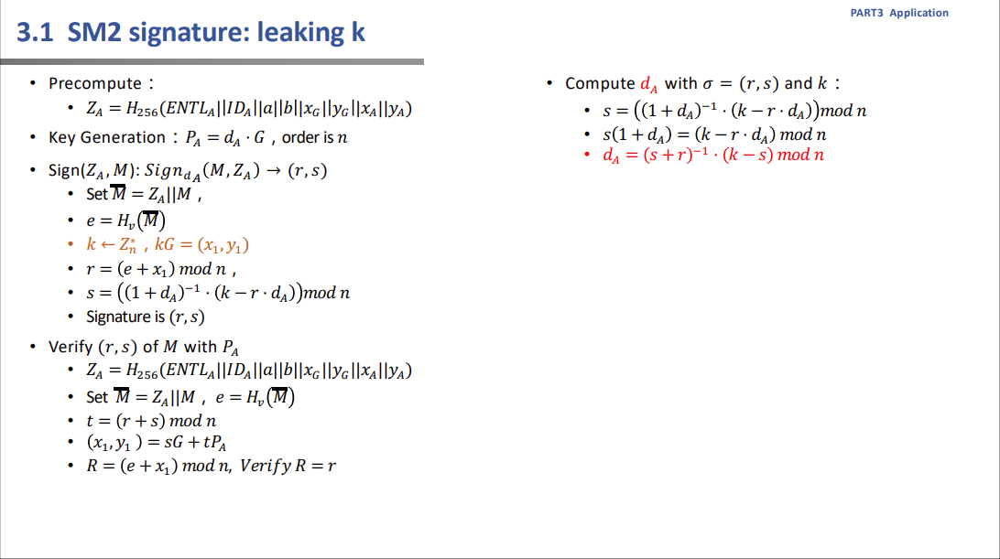
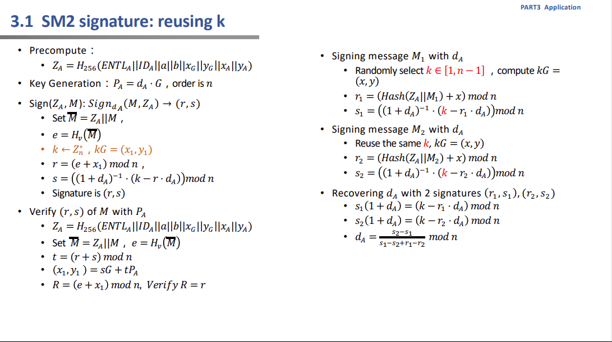
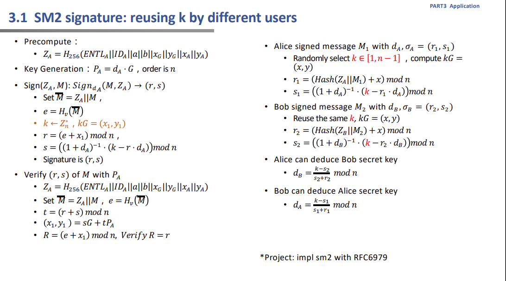
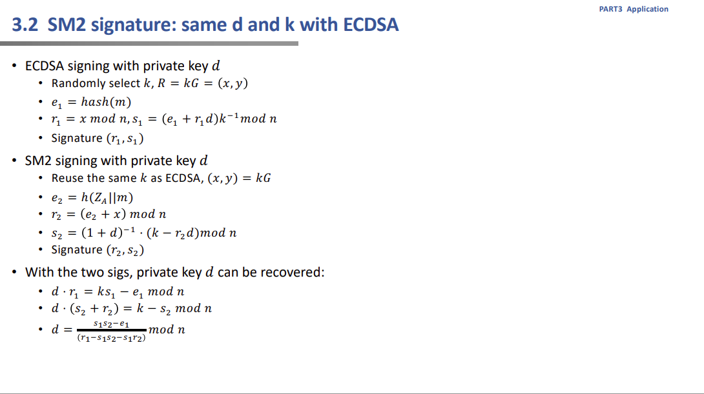
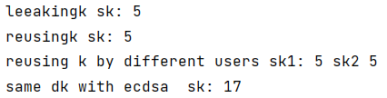

#用概念验证代码验证上述缺陷 
语言：Python

运行环境：PyCharm on Python 3.10.11

sm2的缺陷，一些攻击

1.leaking k
sk=(s+r)^(-1)*(k-s) mod n

2. reusing k
sk=(s2-s1)/(s1-s2+r1-r2)

3. reusing k by different users
sk2=(k-s2)/s2+r2
sk1=(k-s1)/(s1+r1)

4.same dk with ecdsa
 d=(s1s2-e)/(r1-s1s2-s1r2) mod n

运行结果：

