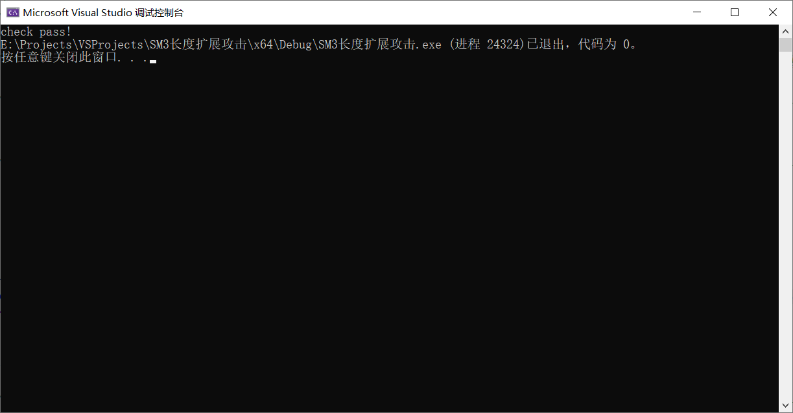

# SM3长度拓展攻击
语言：C++ 

运行环境：Visual Studio 2022

运行结果：

代码说明：对SM3进行基本实现后，即可开始进行长度拓展攻击，攻击的核心代码如下：

~~~c++
bool check_attack_result(uint32_t* known_hash_result, uint8_t* append, unsigned long long append_length, uint32_t* W, uint32_t* W_1,uint8_t *after_padding_input)//W和W_1传入之前必须先分配68和64个uint32_t空间
{
	bool check_result = 1;
	length_extension_attack(known_hash_result, append, append_length, W, W_1);
	uint32_t length_extension_attack_result[8];
	for (int i = 0; i < 8; i++)
	{
		length_extension_attack_result[i] = SM3_hash_result[i];//长度扩展攻击的结果
	}
//-------------------------------------------正常hash----------------------------------------	
	CF_length_extension_attack(IV, after_padding_input, W, W_1);
	CF(IV, append, W, W_1, 8);//正常哈希函数的结果
//-------------------------------------------正常hash----------------------------------------	
	for (int i = 0; i < 8; i++)//检测结果一致性
	{
		if (length_extension_attack_result[i] != SM3_hash_result[i])
		{
			return CHECK_FAIL;
		}
	}
	return CHECK_PASS;
}
~~~

长度拓展攻击是MD结构hash函数容易受到的攻击，通过构造合适的input即可完成。首先进行一次正常hash，然后进行长度拓展攻击，若二者结果一致，说明攻击成功，不一致说明攻击失败。
