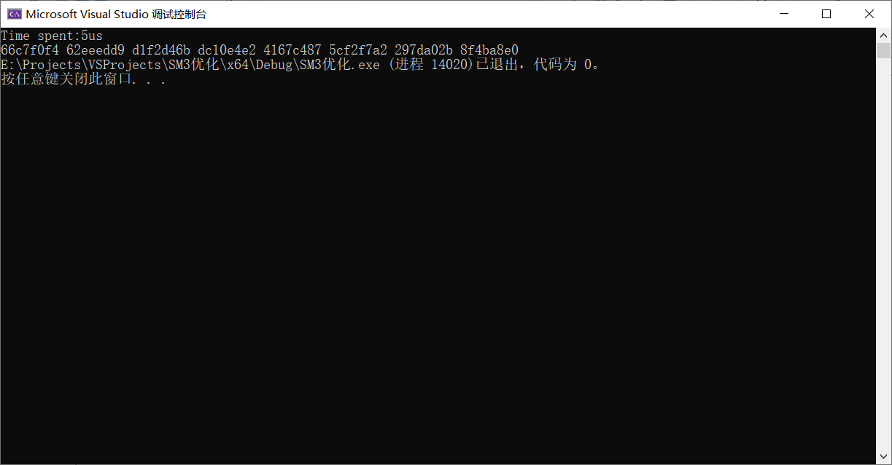

# SM3优化—SIMD
语言：C++ 

运行环境：Visual Studio 2022

消息拓展结果：

压缩函数结果：

重点对CF函数及message extension消息拓展进行SIMD优化，成功部署了8组同时进行，运行效率如图，运行10000次，耗时8000微秒左右，吞吐量是305MB/s左右（只进行一次CF函数即512的消息分组的压缩）相比没有优化的SM3（3微秒一轮，而且一轮只完成一次）有约30倍的性能提升！