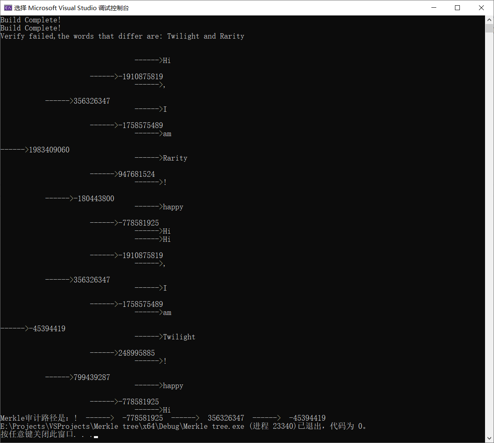

#  RFC6962 Merkle Tree

平台：Windows 10 22H2

语言：C++ 

运行环境：Visual Studio 2022

运行结果：

树节点结构体：

~~~c++
typedef struct Merkle_Tree_Node
{
	struct Merkle_Tree_Node* left_child;//左孩子
	struct Merkle_Tree_Node* right_child;//右孩子
	struct Merkle_Tree_Node* father_node;//父节点
	unsigned int level;//本节点深度
	unsigned int hash_value;//hash值
	char* str;//如果是叶子节点，则没有str赋值为相应字符串
}Merkle_Tree;
~~~

树的构建用递归方法，从左下角开始构建，使用递归构建，构建的思路是：

首先每次都新建一个叶子节点，保存当前递归中的词语，叶子会保存string而中间节点保存hash

首先判断root是否是空，如果空了，说明当前无树，新建树

如果不是空，当前有树，然后找到最后一个叶子节点，再从这个叶子节点向上判断哪一个头节点需要插入

找到需要插入的节点后，判断该节点的子节点的子节点是否是叶子，如果是就插入右孩子，不是的话说明是中间节点，要新建子节点，然后更新同样深度的左树

如果需要插入的节点没找到，说明当前已经是满二叉树了，新增头节点，建立同样深度的子树，返回叶子节点的父节点，给叶子结点的父节点赋值

添加完节点后，自下而上更新hash值即可完成构建

